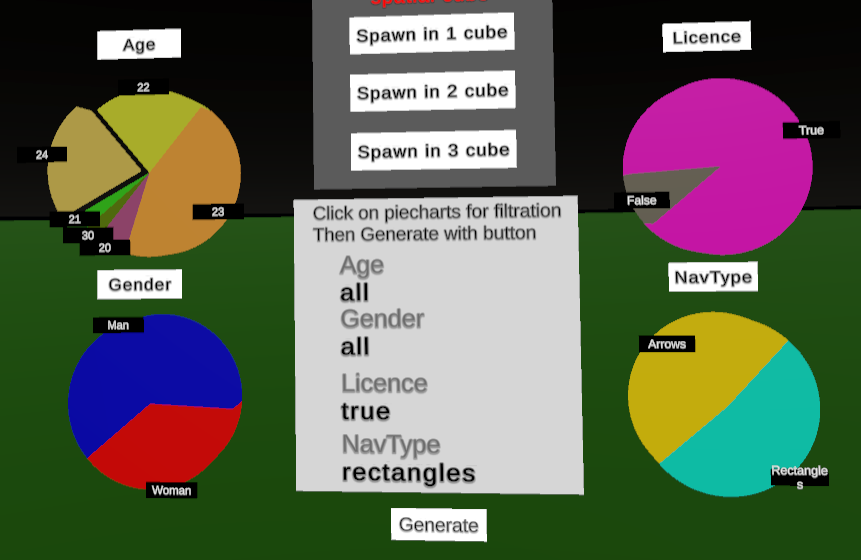
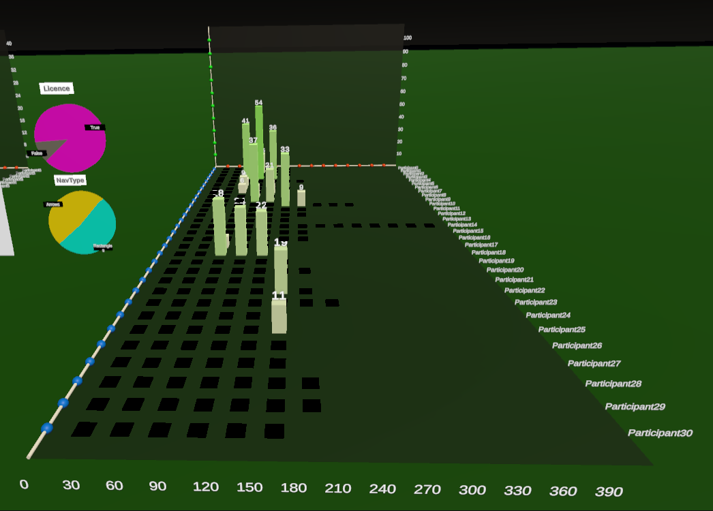
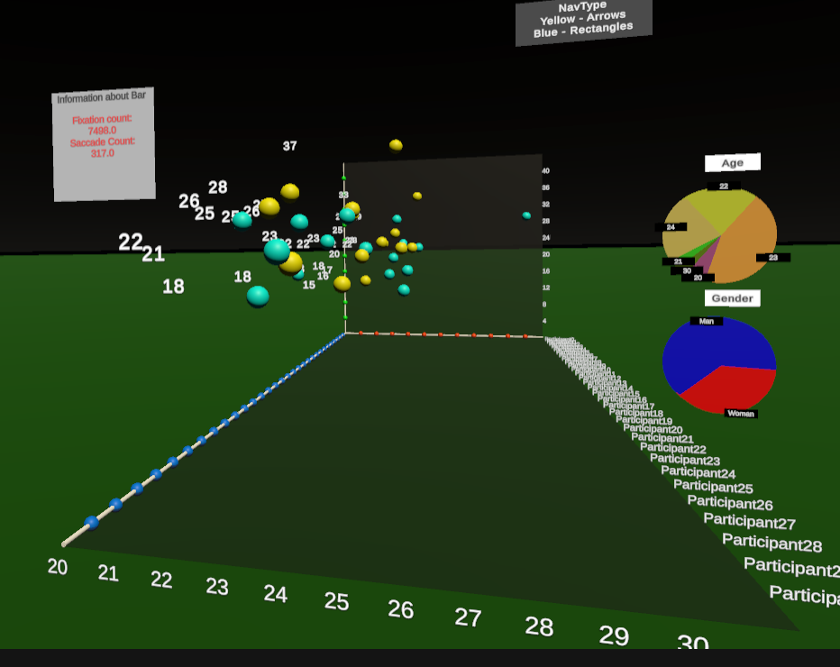
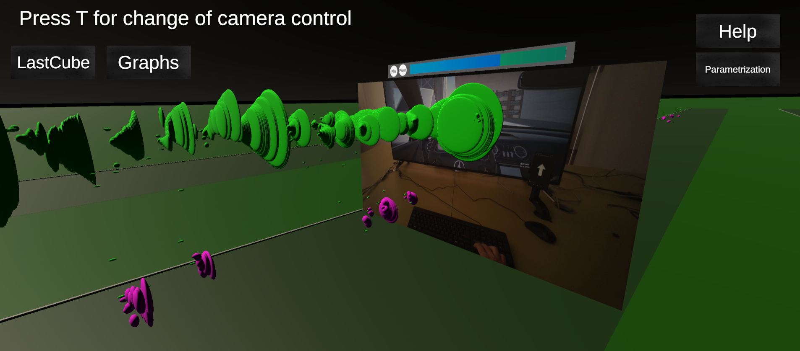
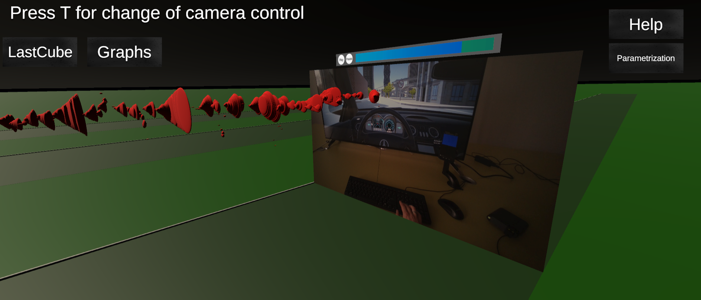
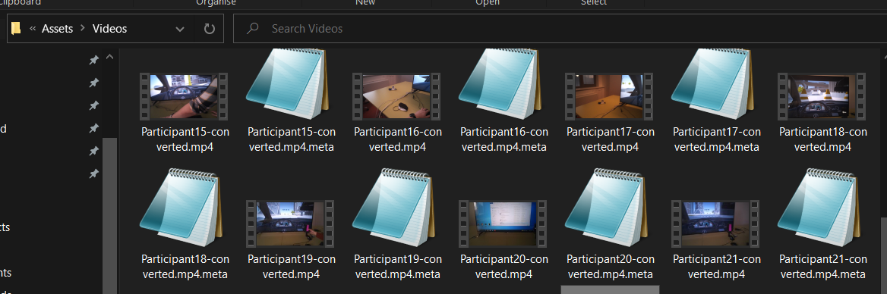

# vd-semestralny-projekt-18-dubovsky-vd-semestralny-projekt-18-dubovsky-ev

# Základné informácie

Tento projekt bol vytvorený na predmet Vizualizácia Dát. 
Téma projektu bola vizualizácia eyetracking dát vo videu.

Na túto tému sme sa rozhodli použiť metaforu "tornád" s pomocou spatial temporal cube, ktoré reprezentujú kam sa užívateľ pozerá. Tornáda menia svoju veľkosť na základe toho, ako dlho sa užívateľ pozerá na dané miesto. Eyetrackingové dáta boli vytvorené pre experiment, ako zmena typu navigácie ovplyvní pozeranie sa šoféra vo vozidle.

# Popis

Všetky základné dáta sú vysvetlené v Help, ktorý sa dá zobraziť tlačidlom Help vpravo hore.

Na začiatku má užívateľ statickú kameru pre ľahšie užívateľské rozhranie.
Pokiaľ si chce kameru zmeniť na dynamickú stačí stlačiť tlačidlo "T" a pohybovať sa s kamerou WASD, Shift a pri potrebe klikania vypnúť zapnúť myšku s tlačidlom ESC. Dynamickú kameru môže využiť, keď potrebuje iný pohľad na vizualizácie ako jeho statický pohľad.
Pri statickej kamere a dynamickej kamere sa môže užívateľ pohybovať tlačidlami vľavo hore - LastCube, Graph, ktoré ho presmerujú na poslednú spatial cube a základné grafy.

Základnú filtráciu vytvoríme pomocou piechartov, pri kliknutí na nich.
Na panely sa zobrazia filtrácie a pri kliknutí na panel sa vygenerujú bargraph a scatterplot(sú vysvetlené v Help).

Pri scatter plote si môžeme zobraziť detaily participant po prejdení myšou pod bodom v scatter plote.

Pri bargraph si môžeme kliknúť na jednotlivé bary, po kliknutí sme si vybrali daného participanta a môžeme spustiť jeho ukázku v spatial temporal cube pomocou hlavného panelu medzi vizualizáciami scatter a bargraphu.
Máme na výber medzi tromi kockami, v ktorých ich chceme "spawnúť".

Po spawnutí sa nám zobrazí v danej kocke vizualizácia za pomoci metafory tornád.

Na jednoduché ovládanie videa máme tlačidlá nad videom - Play, Pause.
A keď chceme video pretáčať stačí nám kliknúť na timestamp v obdlžniku, kde sa ukazuje v akej časti je video.

Parametrizácia je zabezpečená tlačidlom vpravo hore, kde si môže užívateľ zvoliť farbu hitov, farbu AOIHitov(pozrenie sa na navigáciu) alebo priesvitnosť tornád.
Šedé tornáda znamenajú, že používateľ ešte nehájil svoju jazdu.

# Spustenie projektu

Na spustenie projektu, je potrebné si projekt naklonovať a otvoriť v Unity 2023.3.11f.

Taktiež je potrebné vytvoriť priečinok v Assets s názvom "Videos" a pridať tam videá jednotlivých participantov s názvom "ParticipantX-converted.mp4", kde "X" je číslo participanta. Napríklad "Participant5-converted.mp4" alebo "Participant24-converted.mp4".

